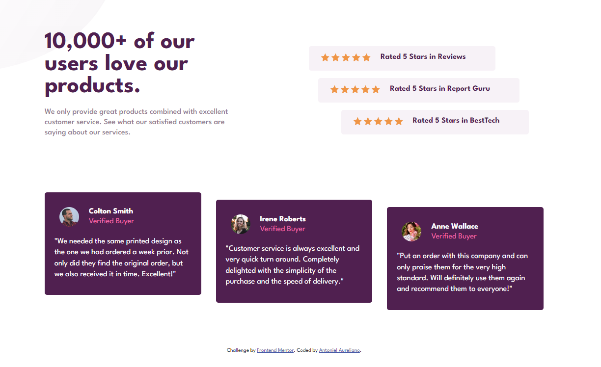

# Frontend Mentor - Social proof section solution

This is a solution to the [Social proof section challenge on Frontend Mentor](https://www.frontendmentor.io/challenges/social-proof-section-6e0qTv_bA). Frontend Mentor challenges help you improve your coding skills by building realistic projects.

## Table of contents

- [Overview](#overview)
  - [Screenshot](#screenshot)
  - [Links](#links)
- [My process](#my-process)
  - [Built with](#built-with)
  - [Useful resources](#useful-resources)
- [Author](#author)

### The challenge

Users should be able to:

- View the optimal layout for the section depending on their device's screen size

### Screenshot

### Links

- Solution URL: [Add solution URL here](https://your-solution-url.com)
- Live Site URL: [Add live site URL here](https://your-live-site-url.com)

### Built with

- Semantic HTML5 markup
- CSS custom properties
- Flexbox
- CSS Grid
- Mobile-first workflow

### Useful resources

- [CSS Grid Layout](https://www.origamid.com/projetos/grid/) - Great examples about CSS Grid Layout that helped me and will help me with any questions that arise when I'm developing. I believe it can help people who are starting out in the development area.

## Author

- Linkedin - [Antoniel Aureliano](https://www.linkedin.com/in/antoniel-aureliano)
- Frontend Mentor - [@Antoniel Aureliano](https://www.frontendmentor.io/profile/AntonielAureliano)
- Twitter - [@AntonielAureli](https://twitter.com/AntonielAureli)
